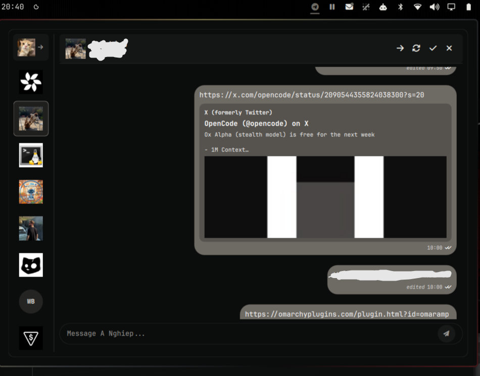

# OmarGram 💬

**Native, lightweight Telegram status bar client for the Omarchy Quattro Desktop.**

OmarGram lets you read and reply to your Telegram chats directly from the Omarchy status bar on the same screen, without needing to open a new window for Telegram. It is designed to be lightweight, snappy, and consume minimal RAM.



---

## ✨ Features

- 💬 **Live Unread Badge**: Real-time unread message counter directly in the Omarchy bar.
- 📱 **1-Click QR Code Login**: Scan the QR code with your phone (*Telegram Settings → Devices → Link Desktop Device*) to log in in 3 seconds.
- ⚡ **Two-Column Fluid Layout**: Sidebar with Direct Messages, Groups, and Channels + smooth-scrolling conversation stream.
- 🚀 **Instant Message Composer**: Quick-reply input with Enter to send and Shift+Enter for multiline formatting.
- ✏️ **Edit & Pin Messages**: Edit sent messages inline and pin/unpin important messages with a direct jump banner.
- ↗️ **Forward & Multi-Select**: Batch select messages with custom checkboxes to forward, copy, or delete at once.
- 🎨 **Theme-Native Visuals**: Matches your active Omarchy colorway, dynamic accent colors, and custom typography.
- 🔒 **Security-First Architecture**:
  - **Encrypted MTProto Transport**: Official client-to-server MTProto 2.0 protocol directly to Telegram cloud servers.
  - **Owner-Only Local Caching**: Enforces strict `0700` directory modes and `0600` file permissions on `~/.config/omargram` and `~/.cache/omargram` to protect user metadata and session tokens from other local users.
  - **Isolated IPC & PID Verification**: Dedicated UNIX socket in `$XDG_RUNTIME_DIR/omargram` with `0600` socket permissions and PID `starttime` verification preventing process hijacking or PID-reuse termination.
  - **Injection & SSRF Safe**: All incoming message text and remote metadata strictly rendered as `Text.PlainText`.

---

## 📦 External Dependencies

OmarGram requires the following Python libraries for MTProto communication and QR code rendering:

| Dependency | Purpose | Package |
| :--- | :--- | :--- |
| `python-telethon` | Native Telegram MTProto API client | `python-telethon` (or `pip install telethon`) |
| `python-qrcode` | QR code generation for instant phone pairing | `python-qrcode` (or `pip install qrcode[pil]`) |
| `python-pillow` | Image handling and profile avatar caching | `python-pillow` (or `pip install pillow`) |

### Install Dependencies:

```bash
python3 -m pip install --user telethon qrcode[pil] pillow
```

---

## 📥 Installation

Install OmarGram using the Omarchy CLI:

```bash
omarchy plugin add https://github.com/JoeJoeflyn/omargram --enable
omarchy restart shell
```

### Manual Bar Configuration

Add `"omargram"` to your desired status bar section in `~/.config/omarchy/shell.json`:

```jsonc
{
  "bar": {
    "sections": {
      "right": [
        "omargram",
        "omarmail",
        "omaramp",
        "omarchy.audio"
      ]
    }
  }
}
```

---

## ⌨️ Shortcuts & Navigation

| Key | Action |
| :--- | :--- |
| `Click Bar Icon` | Toggle OmarGram popout window |
| `Enter` (in composer) | Send message immediately |
| `Shift + Enter` | Insert newline in message |
| `Click Chat` | Open chat & mark messages as read |
| `Esc` | Close active chat or hide panel |

---

## 🗑️ Removal & Uninstallation

To disable and remove OmarGram:

```bash
omarchy plugin disable omargram
omarchy plugin remove omargram
omarchy restart shell
```

To purge cached avatars and session data:

```bash
rm -rf ~/.config/omargram ~/.cache/omargram
```

---

## 📄 License

MIT © [JoeJoeflyn](https://github.com/JoeJoeflyn)
